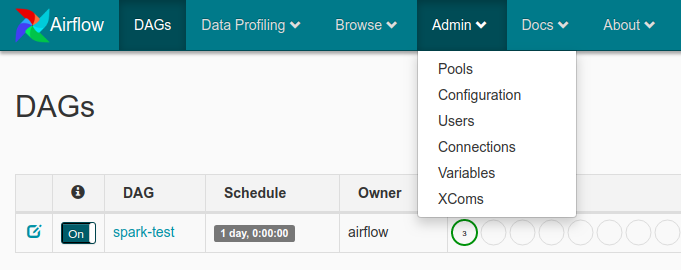

# airflow-dags

# How to run a DAG to test
Configure spark connection acessing airflow web UI http://localhost:8080 and going to Connections

## ToDo

Airflow Sensors
Xcom 
Latest ways to write a dag.
Notifications
Airflow Object Storage

### SQL Library
### Kafka
### Start piecing together
